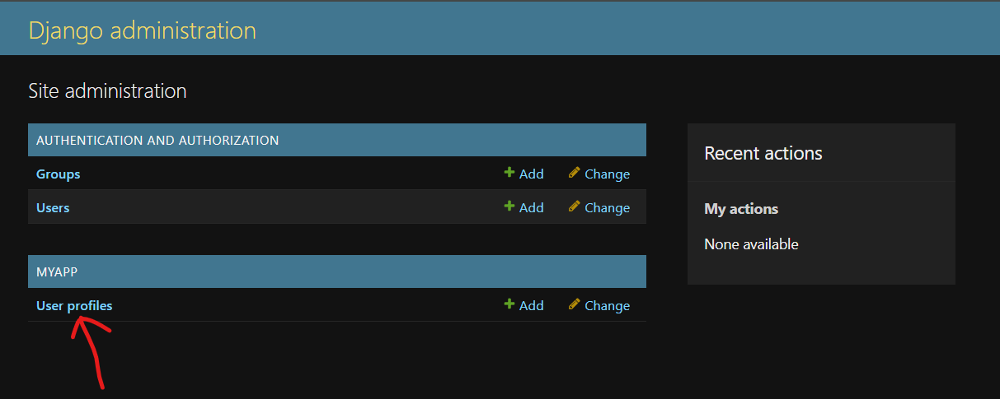
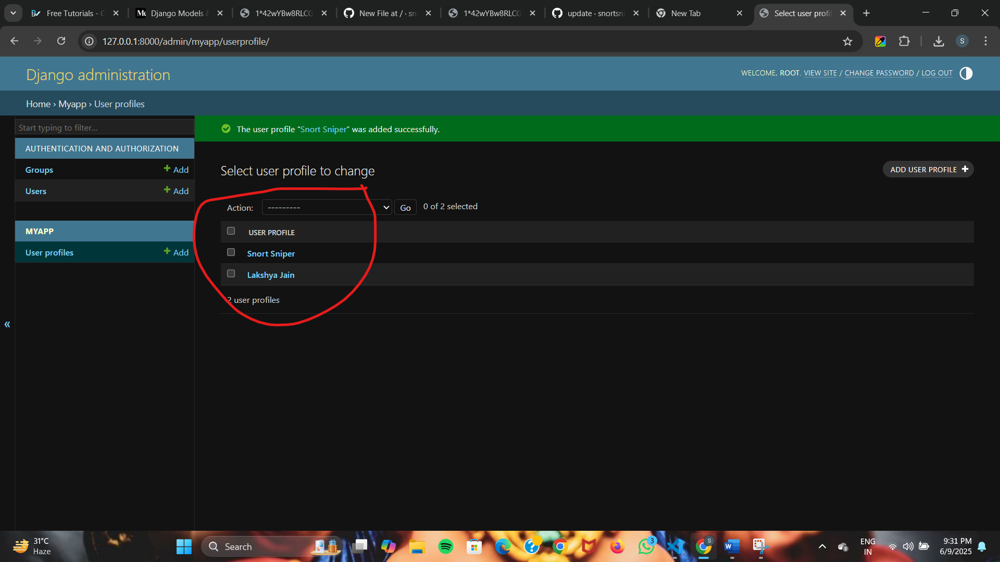

## Follow the steps to add data in database and how to show in front-end.

1. **Step 1 – First Go to the models folder of your app**

    ```bash
   from django.db import models
    class UserProfile(models.Model):
    first_name = models.CharField(max_length=100)
    last_name = models.CharField(max_length=100)
    email = models.EmailField(unique=True)

    def __str__(self):
        return f'{self.first_name} {self.last_name}'
    ```

2. **Step 2 – Then apply this command in terminal**
    ```bash
    python manage.py makemigrations
    ```
    ```bash
    python manage.py migrate
    ```

3. **Step 3 - Go to admin folder of your app**

    ```bash
    from django.contrib import admin
    from .models import UserProfile

    admin.site.register(UserProfile)
    ```
4. **Step 4 - Apply comand in terminal**
    ```bash
    python manage.py runserver
    ```

5. **Step 5 - link wiil be generated `http://127.0.0.1:8000/` like this add admin at last `http://127.0.0.1:8000/admin` login page will be there .... login that page.**
   **You can see this user profile.** <br>
   <br>
   **Add Users**<br>
   
6. **Step 6 - now come to vs code and go to the templates folder in your app and make `profile_list.html` this file, add the code**
    ```bash
    <!DOCTYPE html>
    <html lang="en">
    <head>
        <meta charset="UTF-8">
        <meta name="viewport" content="width=device-width, initial-scale=1, shrink-to-fit=no">
        <link rel="stylesheet" href="https://stackpath.bootstrapcdn.com/bootstrap/4.3.1/css/bootstrap.min.css"
          integrity="sha384-ggOyR0iXCbMQv3Xipma34MD+dH/1fQ784/j6cY/iJTQUOhcWr7x9JvoRxT2MZw1T" crossorigin="anonymous">
        <title>User Profiles www.codeswithpankaj.com</title>
    </head>
    <body>

    <div class="container mt-4">
        <h1>User Profiles</h1>

        <table class="table">
            <thead>
            <tr>
                <th scope="col">First Name</th>
                <th scope="col">Last Name</th>
                <th scope="col">Email</th>
            </tr>
            </thead>
            <tbody>
            
                <tr>
                    <td>{{ profile.first_name }}</td>
                    <td>{{ profile.last_name }}</td>
                    <td>{{ profile.email }}</td>
                </tr>
            
            </tbody>
        </table>

    </div>

    <!-- Bootstrap JS, Popper.js, and jQuery (required for Bootstrap) -->
    <script src="https://code.jquery.com/jquery-3.3.1.slim.min.js"
        integrity="sha384-q8i/X+965DzO0rT7abK41JStQIAqVgRVzpbzo5smXKp4YfRvH+8abtTE1Pi6jizo"
        crossorigin="anonymous"></script>
    <script src="https://cdn.jsdelivr.net/npm/popper.js@1.14.7/dist/umd/popper.min.js"
        integrity="sha384-EeGoh0OM4gNX7Vl+kcZdI2wfcJSctOdhlT5q5Z5ePSSZcxWnuPij8me7z9eCrPU"
        crossorigin="anonymous"></script>
    <script src="https://stackpath.bootstrapcdn.com/bootstrap/4.3.1/js/bootstrap.min.js"
        integrity="sha384-JjSmVgydRHTZX7Ii+vwzgzmveE/QpDYDAtWT1B9t0d7h/6i6U/m6fTqvi2utmjpP"
        crossorigin="anonymous"></script>

    </body>
    </html>
    ```

7. **Step 7 - now come to vs code and go to the views.py in your app, paste this code**

   ```bash
   from .models import UserProfile

   def display_profiles(request):
    profiles = UserProfile.objects.all()
    return render(request, 'profile_list.html', {'profiles': profiles})
   ```
8. **Step 8 - Make new folder on app name `urls.py` and write this code.**
    ```bash
    from django.urls import path
    from .views import display_profiles

    urlpatterns = [
        path('', display_profiles, name='profile_list'),
    ]
    ```
9. **Step 9 - Add this code on project folder in urls.py files**
    ```bash
    from django.contrib import admin
    from django.urls import include, path

    urlpatterns = [
        path('admin/', admin.site.urls),
        path('data/', include('foldername.urls')),
    ]
    ```
10. **Step 10 - Go to the terminal And run the server again.**
    ```bash
    python manage.py runserver
    ```
    open the link `http://127.0.0.1:8000/` that come in terminal and add the `data`.
    <br>
    You can see the the profies that you added in back-end. 
